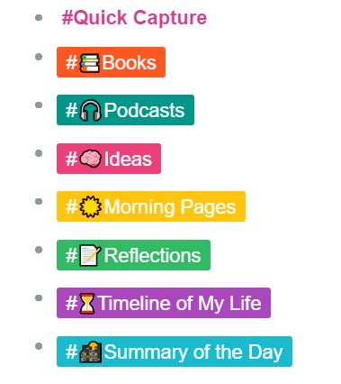

# CyanoRoam
Custom (cyan/teal based) CSS theme for <a href="https://roamresearch.com" target="_blank">Roam Research</a>. You can view the css file  <a href="https://github.com/hiivan/CyanoRoam/blob/master/CyanoRoam.css" target="_blank">here</a>. 

Inspired and built on top of <a href="https://github.com/kanjun/roam-beautified" target="_blank">Roam Beautified</a> created by Github user <a href="https://github.com/kanjun" target="_blank">Kanjun</a>.

# Preview

# How to Install
1. Create a new page called 'roam/css' in Roam Research.
2. Create a bullet point named CyanoRoam (or any name you like).
3. Make a subbullet and type /Code Block. 
4. Copy and paste my css into this code block.

    This is how it should look like

5. Set the code language on the upper right corner of the code block to `css` (it is `clojure` by default). The theme should be applied!

# Features
- Customizable data-tags

- Breadcrumbs for easy viewing of recent pages

# How to Customize
You may play around with the colours, font weight and hover functions.

You can also scroll down to the end to change the customized data-tags (credit to Maggie Appleton: Follow her twitter on [@mappletons](https://twitter.com/mappletons)).

# Other useful links 
Other #roamcult themes: <a href="https://roamresearch.com/#/app/help/page/fJRcVITNY" target="_blank">https://roamresearch.com/#/app/help/page/fJRcVITNY</a>

To change your colours: <a href="https://www.materialui.co/colors" target="_blank">Material Design Colour Palette</a>

Follow me on twitter: <a href="https://twitter.com/hiiiivan" target="_blank">@hiiiivan</a>

# Disclaimer 
I only have a fragmented knowledge on CSS! I am just sharing my theme here since some people have requested for it.
