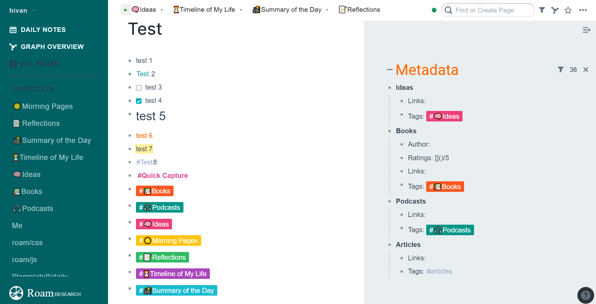

# CyanoRoam
Custom (cyan/teal based) CSS and JavaScript theme for <a href="https://roamresearch.com" target="_blank">Roam Research</a>, a note-taking app. Here is the <a href="https://github.com/hiivan/CyanoRoam/blob/master/CyanoRoam.css" target="_blank">CyanoRoam.css</a> file and the <a href="https://github.com/hiivan/CyanoRoam/tree/master/javascript" target="_blank">JavaScript</a> folder.

Inspired and built on top of <a href="https://github.com/kanjun/roam-beautified" target="_blank">Roam Beautified</a> created by Github user <a href="https://github.com/kanjun" target="_blank">Kanjun</a>.

# Preview


# How to Install
**CSS**
1. Create a new page called [[roam/css]] in Roam Research.
2. Create a bullet point and copy & paste `CyanoRoam` (or any name you like) in it.
3. Create a subbullet. Either type in '/Code Block', or and copy & paste '```'.
4. Copy and paste the code inside the CyanoRoam.css file into this code block.

    This is how it should look like


5. Set the code language on the upper right corner of the code block to `css` (it is `clojure` by default). The theme should be applied!

**JavaScript** (for breadcrumb and template shortcut features respectively)
1. Create a new page called [[roam/js]] in Roam Research.
2. Create a bullet point and copy & paste `{{[[roam/js]]}}`.
3. Create a subbullet. Either type in '/Code Block', or and copy & paste '```'.
4. Copy and paste the code inside either one of the JavaScript file into this code block.
5. Set the code language on the upper right corner of the code block to `javascript` (it is `clojure` by default). Allow the script to run! 


# Features
- Data-tags
    - Credit to Maggie Appleton: Follow her twitter on [@mappletons](https://twitter.com/mappletons)
    - Customizable in the CSS file


- Breadcrumbs (requires JavaScript)
    - For easy viewing of recent pages. 
    - Note: This isn't fully optimized for mobile use.
    - Credit to Github user [Shodty](https://github.com/shodty). Source: [a Reddit post by u/shodty](https://www.reddit.com/r/RoamResearch/comments/hbxooe/playing_with_the_new_roamjs_made_a_feature_to/?utm_source=share&utm_medium=ios_app&utm_name=iossmf)


- Image Resizing Handle
    - I added a big and visible button on the bottom right of the image, making it much easier to resize images.


- Custom Astrolabe loading icon
    - https://i.imgur.com/ucITJk7.gif

- Template shortcuts (requires JavaScript)
    - Credit to: [@ViktorTabori](https://twitter.com/ViktorTabori).
    - For more instructons on how to use this feature, check out https://twitter.com/ViktorTabori/status/1284269497759694848.

# How to Customize
You may play around with the colours, font weight, hover functions and other features mentioned above in the css file.

# Other useful links 
Other #roamcult themes: <a href="https://roamresearch.com/#/app/help/page/fJRcVITNY" target="_blank">https://roamresearch.com/#/app/help/page/fJRcVITNY</a>

To change your colours: <a href="https://www.materialui.co/colors" target="_blank">Material Design Colour Palette</a>

Follow me on twitter: <a href="https://twitter.com/hiiiivan" target="_blank">@hiiiivan</a>

# Disclaimer 
I only have a fragmented knowledge on CSS! I am just sharing my theme here since some people have requested for it on Twitter and Reddit!
